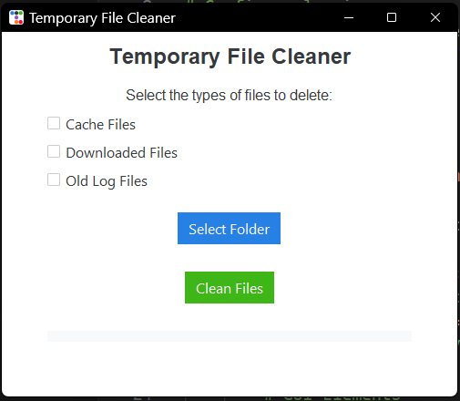

README.md for Temp Cleaner App
This Python application is a simple GUI tool to help you clean up temporary files from your computer.

Features:

User-friendly interface: Easy to use with a clear and intuitive design.
Customizable cleaning options: Choose which types of temporary files to delete:
Cache Files: Files ending with .cache or .tmp
Downloaded Files: Files ending with .download or .part
Old Log Files: Files ending with .log, .old, or .bak
Progress bar: Keeps you informed about the cleaning process.
Status updates: Provides feedback on the number of files deleted.
Logging: Logs deleted files and any errors encountered to a file named temp_cleaner.log.
Requirements:

Python 3.6 or higher
ttkbootstrap library (install with pip install ttkbootstrap)
Instructions:

Install dependencies:

pip install ttkbootstrap
Run the application:

python temp_cleaner.py
Select a folder: Click the "Select Folder" button to choose the directory you want to clean.

Choose file types: Check the boxes for the types of temporary files you want to delete.

Clean files: Click the "Clean Files" button to start the cleaning process.
